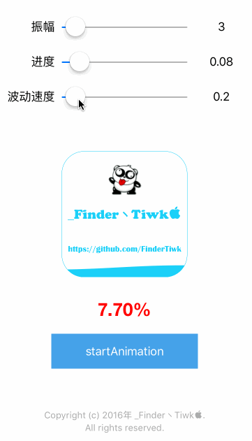
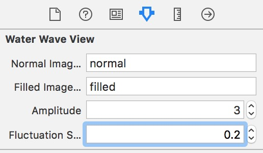

# WaterWaveView
可控进度的波浪动画视图


## 0x00 效果


## 0x01 使用
前提需要准备两个图片，一张为水波未填充时的图片，一张为填充满时的图片


1. 如果通过代码初始化，则和普通UIView一样使用，通过代码设置一些参数
```objective-c
#import "WaterWaveView.h"
```

```objective-c

//code setting
 // {
 //     _waterWaveView.normalImageName = @"normal";
 //     _waterWaveView.filledImageName = @"filled";
 //     _waterWaveView.progress = 0.5;
 //     _waterWaveView.amplitude = 3;
 //     _waterWaveView.fluctuationSpeed = 0.3;
 // }

__weak typeof(self) weakRef = self;
[_waterWaveView setProgressDidChanged:^(CGFloat progress) {
    __strong typeof(weakRef) strongRef = weakRef;
    strongRef.progressSlider.value = progress;
    strongRef.progressValueLabel.text = [NSString stringWithFormat:@"%.2f",progress];
    strongRef.progressLabel.text = [NSString stringWithFormat:@"%.2f%%",progress*100];
}];
```

2. 如果要通过Storyboard或者Xib来初始化，也可以在Xcode中设置一些必要参数。

